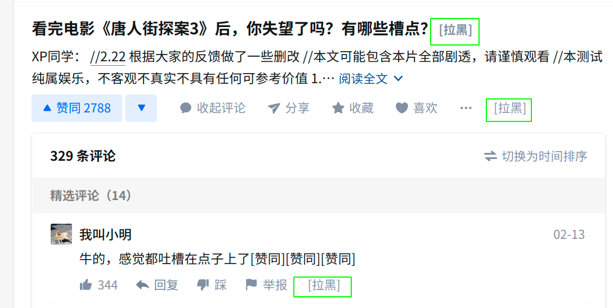

### 知乎推荐页
    1. 一键拉黑题主
    2. 一键拉黑答主 
    3. 一键拉黑评论者

### 使用方法
    1. 安装油候插件
    2. 在油候新建脚本, 将代码复制进去保存即可
    3. 刷新知乎页面后生效, 会自动在标题后答题下方插入拉黑按钮, 点击拉黑对应题主或答主, 可撤销操作
    4. 评论区自动插入拉黑按钮, 点击后自动拉黑评论作者, 可撤销

### 注意事项 & 已知问题
    1. 未适配所有情形
    2. 匿名作者和答主拉黑失败无提示
    3. 评论区点击回复后拉黑按钮错位
